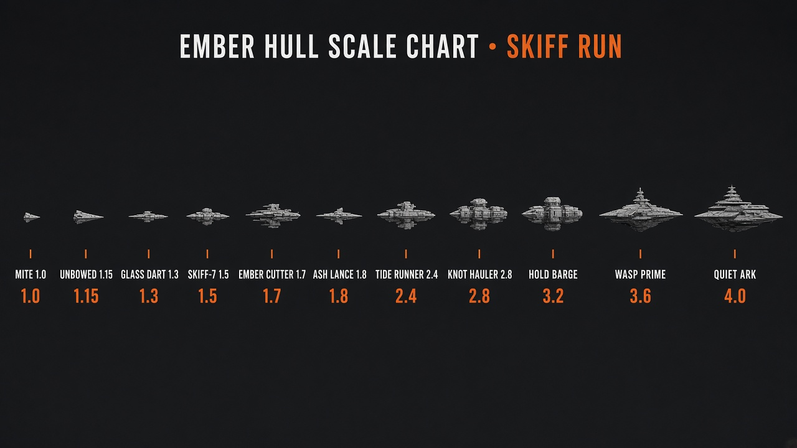

# Hull roster (SVG classes)

## Factions (clarifier)

Classic Palm **Space Trader** did **not** use named factions. Depth came from:

- per-system **politics** (anarchy → military, etc.)
- encounter roles: **police / pirates / traders**
- ship classes shared at yards by tech level

Named-faction fantasy is closer to **Hex Wake / Space Wars** energy. For Skiff we can add light **chart powers** later without cloning ST branding.

## Design rule

- **Common classes** — buyable at yards (tech / wealth gated later). Same SVG for all captains.
- **Exclusives** (optional later) — Corsair prize hull, Warden patrol refit, Compact courier — same base SVG + badge/tint, or a unique path.

## Hull scale (locked 2026-09-13)

Relative size for docs / yard talk. Solo viewport fills lie — use this sheet.

| Hull | Scale |
|------|------:|
| Mite | 1.0 |
| Unbowed | 1.15 |
| Glass Dart | 1.3 |
| Skiff-7 | 1.5 |
| Ember Cutter | 1.7 |
| Ash Lance | 1.8 |
| Tide Runner | 2.4 |
| Knot Hauler | 2.8 |
| Hold Barge | 3.2 |
| Wasp Prime | 3.6 |
| Quiet Ark | 4.0 |

**Unbowed** is in the Ember keep pack (art + scale). Buyable unlock / SVG land in a later slice — not every keep hull is on the Yard tab yet.

## Live (0.4.x)

| id | role | SVG |
|----|------|-----|
| `skiff-7` | starter light freighter | `assets/hulls/skiff-7.svg` |
| `hold-barge` | cargo hauler | `assets/hulls/hold-barge.svg` |
| `ember-cutter` | armed cutter | `assets/hulls/ember-cutter.svg` |

## Planned common classes (SVGs on disk; stats TBD)

Mechanical homage slots (original names only):

| id | role sketch | SVG |
|----|-------------|-----|
| `mite` | cheapest short-hopper | `mite.svg` |
| `glass-dart` | fast courier | `glass-dart.svg` |
| `ash-lance` | pirate-hunter / bounty | `ash-lance.svg` |
| `knot-hauler` | mid cargo | `knot-hauler.svg` |
| `tide-runner` | balanced multi-role | `tide-runner.svg` |
| `quiet-ark` | late tank / retire ferry | `quiet-ark.svg` |
| `wasp-prime` | endgame war hull | `wasp-prime.svg` |
| `unbowed` | gated compact war | `unbowed.svg` (pending) |

## Faction exclusives (parked)

Only if chart powers land:

- **Ash Corsairs** — prize lance variant
- **Ledger Wardens** — inspection cutter
- **Ember Compact** — bonded courier

Everything else stays common.

## Encounter profiles (by hull)

Lane heat is **not** one roll for every ship. Profile knobs (batch-build with reputation + deeper encounters):

| Knobs | Effect |
|-------|--------|
| **Signature** | How noticeable you are (cargo bulk, weapons lit, class size) |
| **Prey value** | Corsairs prefer fat holds; ignore empty mites sometimes |
| **Threat** | Armed / high Ember → more fight, fewer easy shakes; Wardens still care about Ledger |
| **Quiet running** | Small unarmed freighters (Skiff-7, Mite) → fewer rolls overall (ST Flea-style) |

Rough intent:

- **Mite / Skiff-7** — low signature; rare capital-scale events; more ignore / small trader hails
- **Hold Barge / Knot Hauler** — high prey value; Corsairs lean in; Wardens inspect cargo more
- **Ember Cutter / Ash Lance** — higher threat; Corsairs may flee or fight hard; fewer “shake down the soft target” beats
- **Wasp Prime / Quiet Ark** — endgame signature; special patrol attention + denser encounters when present

0.6.0 already has a thin stub (`cargo <= 20 && !weapons` quieter). Full matrix lands with the meaty systems chunk — no postage-stamp PR.
